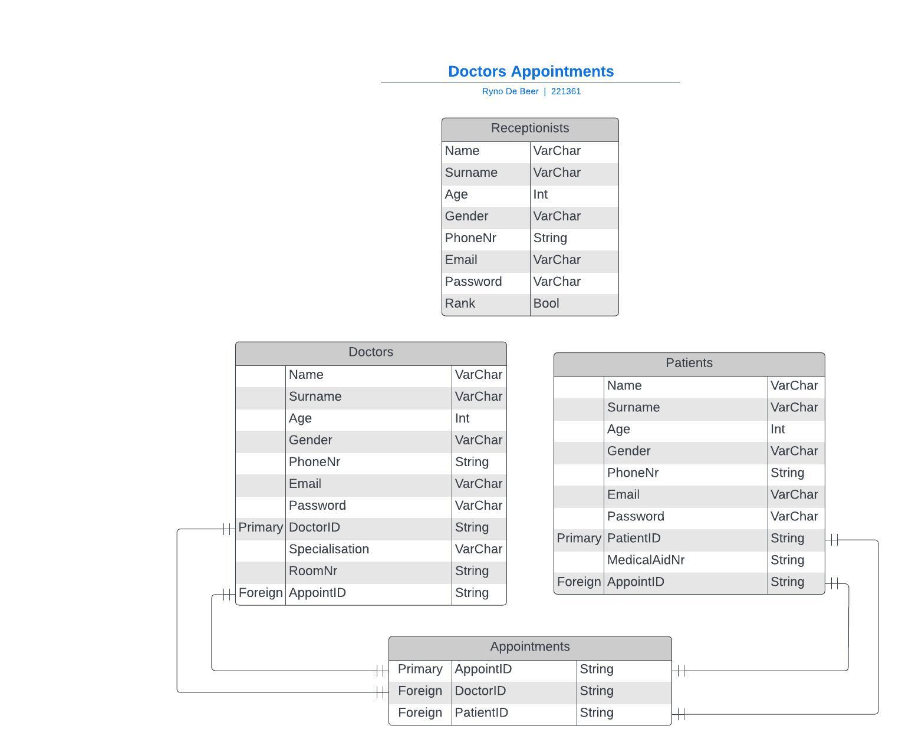

<a name="readme-top"></a>


<!-- PROJECT LOGO -->
<br />
<div align="center">
  <a href="https://github.com/github_username/repo_name">

  

  </a>

<h3 align="center">The Office Doctor</h3>

  <p align="center">
    Appointment management portal
    <br />
    ·
    <a href="https://github.com/github_username/repo_name">View Demo</a>
    ·
  </p>
</div>


<!-- TABLE OF CONTENTS -->
<details>
  <summary>Table of Contents</summary>
  <ol>
    <li>
      <a href="#about-the-project">About The Project</a>
      <ul>
        <li><a href="#built-with">Built With</a></li>
      </ul>
    </li>
    <li>
      <a href="#getting-started">Getting Started</a>
      <ul>
        <li><a href="#prerequisites">Prerequisites</a></li>
        <li><a href="#installation">Installation</a></li>
      </ul>
    </li>
    <li><a href="#project-features">Project Features</a></li>
    <li><a href="#development-process">Development Process</a></li>
    <li><a href="#final-outcome">Final Outcome</a></li>
    <li><a href="#license">License</a></li>
    <li><a href="#author">Author</a></li>
    <li><a href="#acknowledgments">Acknowledgments</a></li>
  </ol>
</details>


<!-- ABOUT THE PROJECT -->
## About The Project


The Office Doctor is an appointment management portal for a doctor's office that is meant for use by the receptionists. The portal alows receptionists to create, edit and delete doctor profles, patient profiles and appointments. Head receptionsists are also able to edit create and delete receptionist profiles. The project uses the LAMP stack, MySQL for the database and PHP for the connection with the database.

<p align="right">(<a href="#readme-top">back to top</a>)</p>


### Built With
LAMP stack

* [![Linux][Linux]][Linux-url]
* [![Apache][Apache]][Apache-url]
* [![MySQL][MySQL]][MySQL-url]
* [![PHP][PHP]][PHP-url]

<p align="right">(<a href="#readme-top">back to top</a>)</p>


<!-- GETTING STARTED -->
## Getting Started

To get a local copy up and running follow these simple example steps.

### Prerequisites

Before you can get started, ensure you have the following prerequisites:

1. **XAMPP:** You need to have XAMPP (or a similar local web server stack) installed on your system. You can download [XAMPP](https://www.apachefriends.org/index.html) and follow the instructions for your operating system.
2. **MysSQL:** MySQL should be included with your XAMPP installation, but make sure it's running and accessible. You may also use other MySQL setups if you prefer.

### Installation

1. **Clone the Repository:**
```sh
git clone https://github.com/Rynoo1/DrAppointment
```
2. **Navigate to the Project Directory:**
```sh
cd DrAppointment
```
3. **Database Configuration:**
Open the projects `db.php` file, which is responsible for the database connection, and ensure it has the correct database credentials. Modify the following lines:
```sh
$conn = mysqli_connect( "localhost", "your_db_username", "your_db_password", "your_db_name" );
```
4. **Create Database:** Create the database using a MySQL management tool like phpMyAdmin or the command line tool.
5. **Import Database Schema:** Import the schema using phpMyAdmin or using the MySQL command-line tool.
6. **Web Server Configuration:** Make sure your web server (Apache in the case of XAMPP) is correctly configured to serve the project's files.
7. **Start Apache and MySQL:** Start the Apache and MySQL services through XAMPP's control panel or using command-line tools if your not using XAMPP.
8. **Access the Application:** Open your web browser and navigate to the appropriate URL to access the project, the URL may vary depending on the web server configuration.

<p align="right">(<a href="#readme-top">back to top</a>)</p>


<!-- USAGE EXAMPLES -->
## Project Features

The Office Doctor allows the user, the receptionist, to create, update and delete entries on the MySQL database which are read and displayed on the portal. This can only happen once the user's log in details have been checked and authenticated. Multiple user's can have access and log in to the portal, but there are only a few head receptionists that are able to edit the details of the receptionists and create new accounts for new receptionists. Once a user has logged in, they are able to see the appointments for the next month as well as the next three appointments on the home page. From here, the receptionist is able to navigate to the doctor or patient page where they can see all doctors and patients as well as update or delete their profiles or add a new one.

* **View All Doctors**


<br/>

* **Add a Patient form**


<br/>

* **Make a new Appointment**


<p align="right">(<a href="#readme-top">back to top</a>)</p>


<!-- ROADMAP -->
## Development Process

During the development of this portal, some of the problems and challenges I faced were:

* CRUD Functionalities
    - Due to some minor typos and an issue where the Auto Index feature was not turned on for certain tables, I was having trouble with getting the CRUD functionalities to work.
    - I was able to fix the errors by using the following code to view the errors and fix what was wrong. 
    ```ini_set('display_errors', 1);```

* Access Control
  - Limiting users to only be able to update or add receptionists if they were a head receptionists or to stop users from accessing pages through the URL without logging in was an issue.
  - To solve this I used session storage to store the users rank and name to both check if they are logged in, if not they are redirected to the login page, and to display the receptionist adding form if they are a head receptionist.

* Login verification was not working
  - This turned out to be an issue with variables that were not set outside of the loop where they were assigned their values.

* Logging out properly
  - To ensure the user is logged out and not allowed in again after, the session storage is cleared when the user presses log out.

<br/>

The visual concept for the portal was a clean look with an aesthetic that matches the medical environment that this will be used in. To match this medical aesthetic, the primary colour for this design was blue, with white as the secondary.

<br/>

**Entity Relationship Diagram (ERD):**



<p align="right">(<a href="#readme-top">back to top</a>)</p>


<!-- CONTRIBUTING -->
<!-- ## Contributing

Contributions are what make the open source community such an amazing place to learn, inspire, and create. Any contributions you make are **greatly appreciated**.

If you have a suggestion that would make this better, please fork the repo and create a pull request. You can also simply open an issue with the tag "enhancement".
Don't forget to give the project a star! Thanks again!

1. Fork the Project
2. Create your Feature Branch (`git checkout -b feature/AmazingFeature`)
3. Commit your Changes (`git commit -m 'Add some AmazingFeature'`)
4. Push to the Branch (`git push origin feature/AmazingFeature`)
5. Open a Pull Request

<p align="right">(<a href="#readme-top">back to top</a>)</p> -->

## Final Outcome
- demo video
- promo video

<p align="right">(<a href="#readme-top">back to top</a>)</p>

<!-- LICENSE -->
## License

Distributed under the MIT License. See `LICENSE.txt` for more information.

<p align="right">(<a href="#readme-top">back to top</a>)</p>

<!-- CONTACT -->
## Author

Ryno de Beer - 221361@virtualwindow.co.za

LinkedIn - www.linkedin.com/in/rynodebeer01

<p align="right">(<a href="#readme-top">back to top</a>)</p>


<!-- ACKNOWLEDGMENTS -->
## Acknowledgments

* [ReadMe](https://github.com/othneildrew/Best-README-Template/tree/master)
* [Badges](https://shields.io/)
* []()

<p align="right">(<a href="#readme-top">back to top</a>)</p>


<!-- MARKDOWN LINKS & IMAGES -->
<!-- https://www.markdownguide.org/basic-syntax/#reference-style-links -->
[contributors-shield]: https://img.shields.io/github/contributors/github_username/repo_name.svg?style=for-the-badge
[contributors-url]: https://github.com/github_username/repo_name/graphs/contributors
[forks-shield]: https://img.shields.io/github/forks/github_username/repo_name.svg?style=for-the-badge
[forks-url]: https://github.com/github_username/repo_name/network/members
[stars-shield]: https://img.shields.io/github/stars/github_username/repo_name.svg?style=for-the-badge
[stars-url]: https://github.com/github_username/repo_name/stargazers
[issues-shield]: https://img.shields.io/github/issues/github_username/repo_name.svg?style=for-the-badge
[issues-url]: https://github.com/github_username/repo_name/issues
[license-shield]: https://img.shields.io/github/license/github_username/repo_name.svg?style=for-the-badge
[license-url]: https://github.com/github_username/repo_name/blob/master/LICENSE.txt
[linkedin-shield]: https://img.shields.io/badge/-LinkedIn-black.svg?style=for-the-badge&logo=linkedin&colorB=555
[linkedin-url]: https://linkedin.com/in/linkedin_username
[product-screenshot]: images/screenshot.png
[Next.js]: https://img.shields.io/badge/next.js-000000?style=for-the-badge&logo=nextdotjs&logoColor=white
[Next-url]: https://nextjs.org/
[React.js]: https://img.shields.io/badge/React-20232A?style=for-the-badge&logo=react&logoColor=61DAFB
[React-url]: https://reactjs.org/
[Vue.js]: https://img.shields.io/badge/Vue.js-35495E?style=for-the-badge&logo=vuedotjs&logoColor=4FC08D
[Vue-url]: https://vuejs.org/
[Angular.io]: https://img.shields.io/badge/Angular-DD0031?style=for-the-badge&logo=angular&logoColor=white
[Angular-url]: https://angular.io/
[Svelte.dev]: https://img.shields.io/badge/Svelte-4A4A55?style=for-the-badge&logo=svelte&logoColor=FF3E00
[Svelte-url]: https://svelte.dev/
[Laravel.com]: https://img.shields.io/badge/Laravel-FF2D20?style=for-the-badge&logo=laravel&logoColor=white
[Laravel-url]: https://laravel.com
[Bootstrap.com]: https://img.shields.io/badge/Bootstrap-563D7C?style=for-the-badge&logo=bootstrap&logoColor=white
[Bootstrap-url]: https://getbootstrap.com
[JQuery.com]: https://img.shields.io/badge/jQuery-0769AD?style=for-the-badge&logo=jquery&logoColor=white
[JQuery-url]: https://jquery.com 
[MySQL]: https://img.shields.io/badge/MySQL-005C84?style=for-the-badge&logo=mysql&logoColor=white
[MySQL-url]: https://https://www.mysql.com/
[PHP]: https://img.shields.io/badge/PHP-777BB4?style=for-the-badge&logo=php&logoColor=white
[PHP-url]: https://www.php.net/
[Linux]: https://img.shields.io/badge/Linux-FCC624?style=for-the-badge&logo=linux&logoColor=black
[Linux-url]: https://www.linux.org/
[Apache]: https://img.shields.io/badge/-Apache-red?logo=apache
[Apache-url]: https://httpd.apache.org/